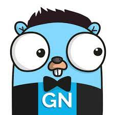

<p align="center">
 
</p>

<h1 align="center">
News Feeder
</h1>

Using golang framework (Gin) to create a web-application. This simple web-app uses golang gin framework to create a rest-api
applications. The main idea is to learn **Gin**, user request body parsing and **Golang unit testing**. After that dockerizing
our golang application.

## What do I learn from this project?
- Golang interface
- Gin framework
- Unit testing
- Docker

## Golang Interface
Interfaces are named collections of method signatures. To see an example, check the project _internal/provider/provider.go_
to see how you can use interfaces.

Read more about interfaces at [Golang Website](https://gobyexample.com/interfaces).

## Gin framework
Gin is a web framework written in Go (Golang). 
It features a martini-like API with performance 
that is up to 40 times faster thanks to _http-router_.

Read more about **Gin** at [Gin Website](https://gin-gonic.com/).

## Unit testing
Golang provides unit testing for its applications. Any file that ends with
_*test.go_ can be executed as a test file.


Unit testing is an important part of writing
principled Go programs. 
The **testing package** provides the tools we 
need to write unit tests and the go test 
command runs tests.

You can execute tests by following command:
```shell
go test -v ./...
```

Read more about **Tests** at [Go Dev](https://go.dev/doc/tutorial/add-a-test).

## Docker
The most straightforward way to use this 
image is to use a Go container as both the build 
and runtime environment. 
In your Dockerfile, writing something along 
the lines of the following will compile and run 
your project (assuming it uses go.mod for 
dependency management):
```Dockerfile
FROM golang:1.18

WORKDIR /usr/src/app

# pre-copy/cache go.mod for pre-downloading dependencies and only redownloading them in subsequent builds if they change
COPY go.mod go.sum ./
RUN go mod download && go mod verify

COPY . .
RUN go build -v -o /usr/local/bin/app ./...

CMD ["app"]
```

## Setup project
After cloning the project run the following command:
```shell
go run internal/cmd/main.go
```

And this will create the server on **localhost:8080**.
```shell
[GIN-debug] [WARNING] Creating an Engine instance with the Logger and Recovery middleware already attached.

[GIN-debug] [WARNING] Running in "debug" mode. Switch to "release" mode in production.
 - using env:   export GIN_MODE=release
 - using code:  gin.SetMode(gin.ReleaseMode)

[GIN-debug] GET    /newsfeed                 --> github.com/amirhnajafiz/news-feeder/internal/http/handler.NewsFeedGet.func1 (3 handlers)
[GIN-debug] POST   /newsfeed                 --> github.com/amirhnajafiz/news-feeder/internal/http/handler.NewsFeedPost.func1 (3 handlers)
[GIN-debug] [WARNING] You trusted all proxies, this is NOT safe. We recommend you to set a value.
Please check https://pkg.go.dev/github.com/gin-gonic/gin#readme-don-t-trust-all-proxies for details.
[GIN-debug] Environment variable PORT is undefined. Using port :8080 by default
[GIN-debug] Listening and serving HTTP on :8080
[GIN] 2022/08/22 - 10:37:48 | 204 |     157.375µs |             ::1 | POST     "/newsfeed"
[GIN] 2022/08/22 - 10:37:51 | 200 |     285.208µs |             ::1 | GET      "/newsfeed"
```

## Setup on docker
You can run the application by the following steps.<br />
First build the docker image:
```shell
docker build . -t newsfeeder-app
```

Then run it on a container:
```shell
docker run -rm -it -p 8080:8080/tcp newsfeeder-app:latest
```

And then you should be able to see the app available on **localhost:8080**.

Stop application:
```shell
docker stop CONTAINERNAME
```

## Setup on docker compose
You can run application on docker with _docker-compose_:
```shell
docker compose up -d
```

Stop application
```shell
docker compose down
```

## Requests
Get news:
```
curl localhost:8080/newsfeed
```

Post news:
```shell
curl -X POST -d '{"title":"me2", "post":"me1"}' localhost:8080/newsfeed
```
