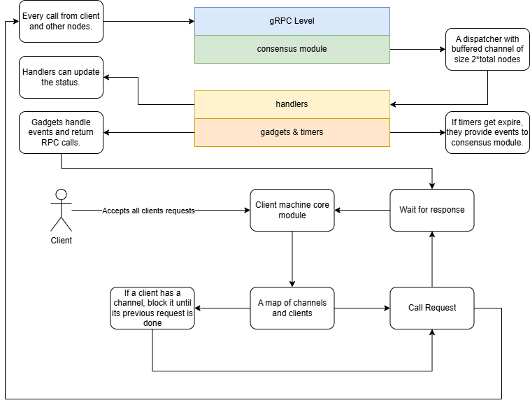
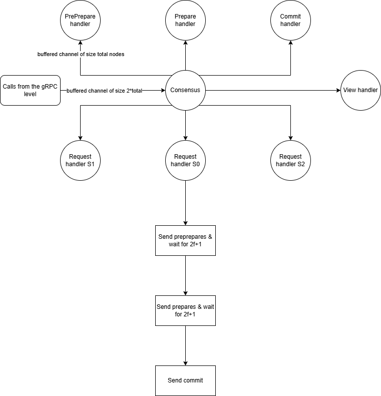
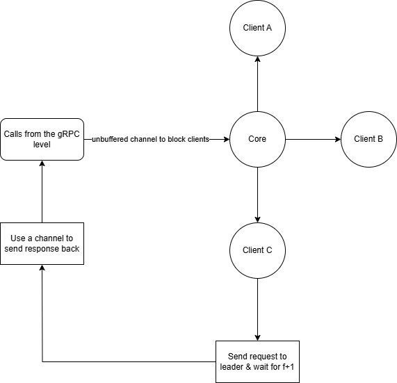

# PBFT

Theis project is for implementing a version of the PBFT (Practical Byzantine Fault Tolerance) consensus protocol. PBFT can achieve consensus with a minimum of 3f + 1 nodes, where *f* represents the maximum number of faulty (Byzantine) nodes that may be present at the same time.

In this project, I implement the normal operation and the view-change routine of a BFT protocol called linear-PBFT. Unlike PBFT, the normal operation of linear-PBFT achieves consensus with linear communication complexity, though its view-change routine remains the same as in PBFT.

Similar to the `APAXOS` project, a basic distributed banking application will be used; however, in this case, all client requests will be handled by all nodes.

## Requirements

- Programming language: Golang 1.23
- Communication: gRPC v2, protoc3
- Logging: zap logger
- Configs: koanf

## Features

- Digital Certificates
- Store all messages from other nodes inside the log
- Optimal Linear PBFT
- Timers
- View-change
- Checkpointing
- Threshold Signature

## Compile and Run

You can use `go build -o main` to create a runnable file. After that, you can run `app`, `node`, and `controllers` commands by specifing a config file path. An example config file:

```yaml
# ctl files is a list of config files for controller app
ctl_files:
  - "path"

# log level can be (debug, info, warn, error, panic, fatal)
log_level: "debug"

# the testcase file path
csv: "test/path"

# certificates and keys
tls:
  private_key: "./configs/client/client.key"
  public_key: "./configs/client/client.crt"
  ca_key: "./configs/ca.crt"

# iptable maps all clients and nodes to their ip and metadata
iptable:
  - key: "S1"
    value: "127.0.0.1:5001"
    metadata: 0
  - key: "S2"
    value: "127.0.0.1:5002"
    metadata: 1
  - key: "S3"
    value: "127.0.0.1:5003"
    metadata: 2
  - key: "S4"
    value: "127.0.0.1:5004"
    metadata: 3
  - key: "client"
    value: "127.0.0.1:6001"
    metadata: -1

# list of the systems clients
clients:
  - key: "A"
    metadata: 10

# node app configs
node:
  port: 6001
  node_id: client
  bft: # pbft configs
    client_retrys: 5
    k_watermark: 100
    checkpoint: 2
    total: 4
    majority: 3
    responses: 2
    request_timeout: 20000 # in milliseconds
    majority_timeout: 100 # in milliseconds
    view_timeout: 1 # in seconds
    viewchange_timeout: 100 # in milliseconds
    newview_timeout: 100 # in milliseconds
```

## Schema

In the following diagrams, you can see system, consensus, and core (aka app) logic.



---



---


